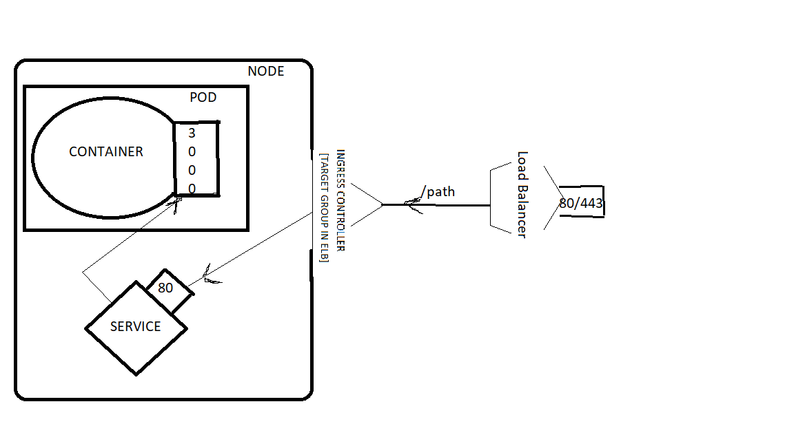

# K8s
Deploy a containerized application to Kubernetes using helm
1. node:
    a. build the node application on local.
        [- npm init -y(creates --> pck.json)
         - npm install express(framework --> creates nodemodule and pck-lock.json)]
    b. build a node application and dockerize it 1st. 
        [- docker build -t my-node-app .
         - docker run -p 3000:3000 my-node-app]
    c. push the dockerised container to artifact(dockerhub) so that minikube can access it.
        [- docker login
         - docker tag my-node-app:latest dishadgithub/node-application:0.0.1
         - docker push dishadgithub/node-application:0.0.1]
    d. deploy the dockerizes application on minikube using helm.
        [- helm create helm-node
         - using nginx controller to set up loadbalancer to expose the application to outer world.
         - the application is listening at port 3000, container where the application is running on the active pod is also listening at targetport 3000 but the clusterip service is listening on the port 80(*listening - server waiting for incoming connections on a specific network port*)]

Note: minikube doesnt create any load balancer. So this wasnt successful.

On AWS:

